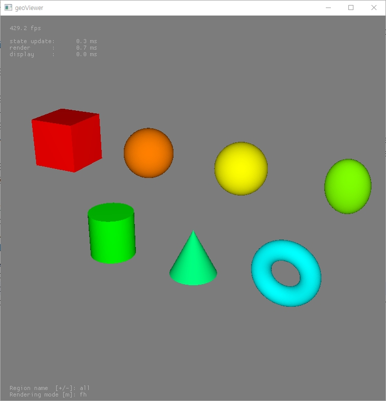
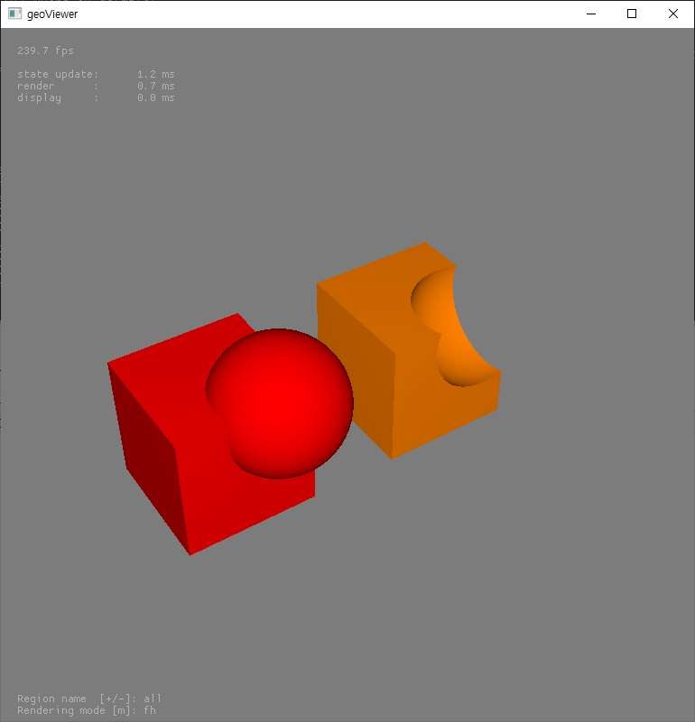
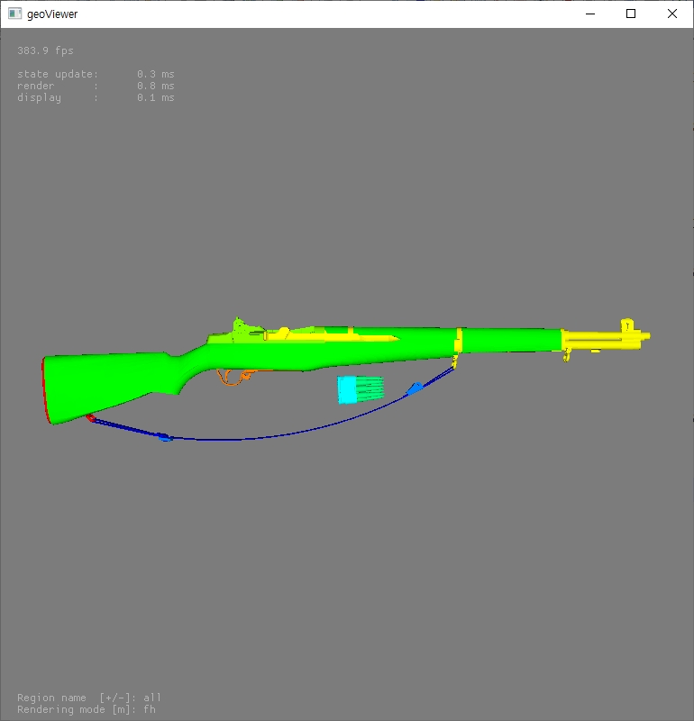
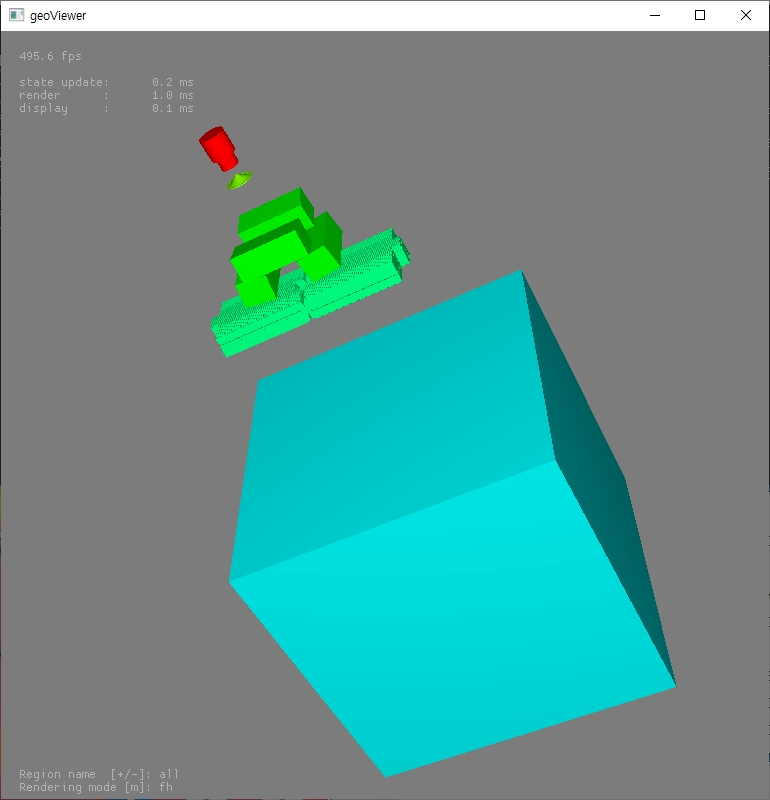

# MCRT2builder
Ray Tracing acclerated Radiation Transport Monte Carlo, RT2, geometry builder standalone

## Features
- CSG world generator for the RT2 GPU-accelerated Monte Carlo

- CSG to Mesh approximation, which optimized to the RTcore architecture

Cross-platform support:
 - Windows 10 
 - Ubuntu

## Getting Started

### Requirements
- **CMake** >= 3.7 (tested: 3.25.1)

- **C++17** (tested on Visual Studio 2019, g++ 9.4.0)

- **CUDA** >= 11.x (tested: CUDA 12.2 and 12.6)

- **GPU**: Nvidia Pascal (GTX 10xx) or later 

 - GTX 1660 super, Nvidia RTX 4060 ti, Nvidia RTX 4090 tested

- **OptiX 7**: Nvidia Ray-Tracing engine (tested on 7.6.0)

- **GSL**: GNU Scientific Library

- **CGAL**: The Computational Geometry Algorithms Library, must be installed in vcpkg (tested on 6.0.1)

- **GLFW**: Open Source, multi-platform library for OpenGL

- (Windows) **vcpkg**: Microsoft package manager

- (Optional) **Python3** >= 3.8 (tested: 3.8.10, 3.8.20)

### Installation

git clone https://github.com/dlc2048/MCRT2builder.git

cd MCRT2builder

git submodule update --init --recursive

mkdir build

cd build

#### Configure

cmake3-gui is recommended

##### Windows

cmake ../ -DVCPKG_PATH=${vcpkg_path} -DOptiX_INSTALL_DIR=${optix_path} -DBUILD_SHARED_LIBS=1

##### Linux 

cmake ../ -DOptiX_INSTALL_DIR=${optix_path} -DBUILD_SHARED_LIBS=1

#### Build

##### Linux

make

cd ..

export MCRT2_HOME=$(pwd)

##### Windows

Open build/MCRT2.sln in Visual Studio

Build the solution

Set environment variable:
MCRT2_HOME = $(RT2QMD_home_directory)

#### (optional) Python interface

- Python interface may be required if someone want to build voxel geometry from NIFTI data

cd MCRT2builder/MCRT2interface

pip3 install .

### Command-line execution

(builder) RT2builder -i [input_file.txt] -o [output_log.txt]

(viewer) RT2viewer

See [input_syntax.pdf] for more detail

## License

Apache-2.0 License. See **LICENSE** for details

## Citing This Method

Lee, Chang-Min, Taewan Kim, and Sung-Joon Ye. "Ray-Tracing Acceleration Technique for Monte Carlo 
Radiation Transport in Ubiquitous Geometry." Computer Physics Communications (2026): 110134.

## Contact

- This package contains only RT2 geometry builder and viewer. If someone want to access to the
  full Monte Carlo program, please contact to the principal investigator of the RT2 project.

### Technical or bug issues

Author: Chang-Min Lee

Email: dlc2048@snu.ac.kr

### Principal Investigator

Author: Sung-Joon Ye

Email: sye@snu.ac.kr

## Examples

- Example 1. Basic surface primitives [/examples/basic/1_basic_solid]

- Example 2. Boolean operation in Construtive Solid Geometry [/examples/basic/3_boolean]

- Example 3. Complex STL mesh geometry [/examples/advanced/rifle]

- Example 4. Complex CSG LINAC geometry [/examples/advanced/linac]

